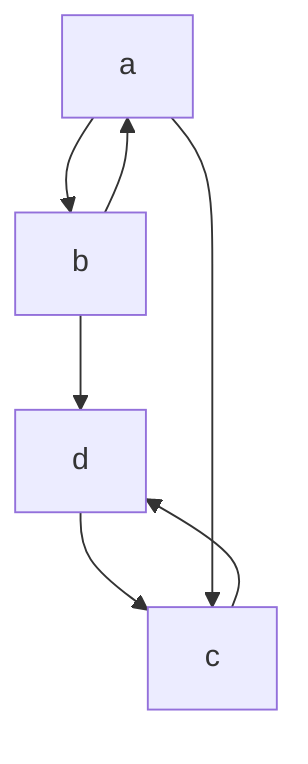

# This repo contains all go related code written for [my blog](https://www.vivekakupatni.com/)

 

**Table of Contents**

* [Running test_cases](#running-test_cases)
* [Running Examples](#running-examples)
    * [Strongly Connected Components Example](#strongly-connected-components-example)
    * [Power set using Iterator example](#power-set-using-iterator-example)


## Running test_cases

```bash
(ins)-> task test                              
task: [test] PATH="$HOME/.local/go/bin:$HOME/go/bin:$PATH" staticcheck ./...
task: [test] PATH="$HOME/.local/go/bin:$HOME/go/bin:$PATH" golangci-lint run ./...
task: [test] go vet ./...                     
task: [test] go test -v -race ./...                                                           
?       github.com/apatniv/website_golang       [no test files]
=== RUN   TestComputeSCC               
=== RUN   TestComputeSCC/linear_chain                                                         
=== RUN   TestComputeSCC/single_isolated_nodes
=== RUN   TestComputeSCC/complete_3_node_cycle                                                
=== RUN   TestComputeSCC/4_components_example
--- PASS: TestComputeSCC (0.00s)                                                              
    --- PASS: TestComputeSCC/linear_chain (0.00s)
    --- PASS: TestComputeSCC/single_isolated_nodes (0.00s)
    --- PASS: TestComputeSCC/complete_3_node_cycle (0.00s)          
    --- PASS: TestComputeSCC/4_components_example (0.00s)
PASS                                                         
```
> Output truncated 

## Running Examples


### Strongly Connected Components Example




```bash
(ins)-> go run main.go strongly_connected_component
2024/11/10 10:23:44 INFO Running example=strongly_connected_component
2024/11/10 10:23:44 INFO Running the SCC example
2024/11/10 10:23:44 DEBUG Dfs status node=c discover=4 finish=5
2024/11/10 10:23:44 DEBUG Dfs status node=d discover=3 finish=6
2024/11/10 10:23:44 DEBUG Dfs status node=b discover=2 finish=7
2024/11/10 10:23:44 DEBUG Dfs status node=a discover=1 finish=8
2024/11/10 10:23:44 INFO SCC Results components="[[b a] [c d]]"
```


### Power set using Iterator example

```bash
(ins)-> go run main.go power_set
2024/11/10 10:40:14 INFO Running example=power_set
Computing powerset for=[9 50 99]
value = []
value = [9]
value = [50]
value = [9 50]
value = [99]
value = [9 99]
value = [50 99]
value = [9 50 99]
```

### Help Message 

```bash
(ins)-> go run main.go -h
Usage: main <example> [flags]

Arguments:
  <example>    Name of the example: strongly_connected_component,power_set

Flags:
  -h, --help    Show context-sensitive help.
```
